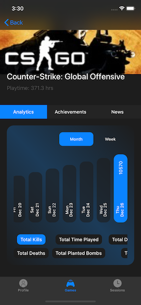
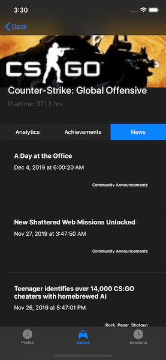
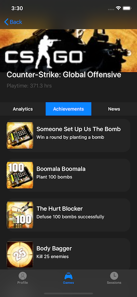
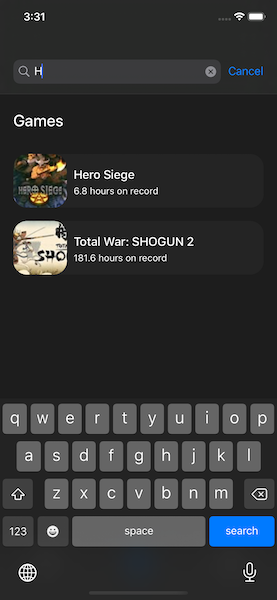

# Ikou
> Challange from [funcodechallenge](https://funcodechallenge.com/]). Steam Interface.

[![Swift Version][swift-image]][swift-url]
[![License][license-image]][license-url]
  

## Requirements
- iOS 10.0+
- Xcode 10.2.1

## Features
- [x] Profile
- [x] Friends list
- [x] Owned games
- [x] Last sessions
- [x] Sensitive search
- [x] Game News
- [x] Game Achievements
- [x] Game Analytics
- [x] Offline mode
- [x] Dark mode

## Architecture Patterns
- VIPER: because of ease, clarity. I think it has some advantages of working with static information. For instance, for messenger app, I would prefer MVVM with Rx. 
- Singleton(ehh..), Facade, Factory

## A few words about stack
- [x] Git Flow
- [x] SwiftLint: to keep code clean
- [ ] Fastlane with Match: delivery - have no app serts
- [ ] CI: Github Actions: automate
- [x] Unit tests: no TDD, no BDD, but also with ❤
- [ ] Crashhlytics: as always 😉
- [x] No xib, storyboards

## API
- ISteamUser/GetPlayerSummaries/v0002/
- IPlayerService/GetOwnedGames/v0001/
- ISteamUser/GetFriendList/v0001/
- ISteamNews/GetNewsForApp/v2/
- ISteamUserStats/GetSchemaForGame/v2/
- IPlayerService/GetRecentlyPlayedGames/v0001/
- ISteamUserStats/GetUserStatsForGame/v2/

[Additional methods you can see here](https://steamcommunity.com/dev)

## Dependencies
#### Color: Hue
- To get hex color. 
#### Keyboard: IQKeyboardManagerSwift
- Smart keyboard.
#### Storage: KeychainSwift
- To save interesting info, like passwords, token etc.
#### Network: Moya
- Additional layer to work with Alamofire. Really easy to work with network.
#### Database: Realm
- Save, fetch, etc. data, also known as local database  - easy and powerful.
#### AutoLayout: SnapKit
- Easy to work with constraints programmatically.

## Demo

## Screenshots

## Design 
> [FIgma](https://www.figma.com/file/T9PhYjKNKEMU8Or3hBskTx/Ikou?node-id=14%3A2)

## There is always room to improve
- [ ] UI/UX - make more user friendly, with beautiful charts
- [ ] Friend detail page with compares of progress/achievements
- [ ] Connect with new APIs
- [ ] Push notifications: friend is online, look to report of analytics etc.
- [ ] Feature: Steam Items with prices etc.
- [ ] Steam Guard

## Meta

Yeskendir Salgara– [facebook](https://www.facebook.com/salgara.eskendr) – salgarayes@gmail.com

[https://github.com/sorunokoe](https://github.com/sorunokoe/)

[swift-image]:https://img.shields.io/badge/swift-5.0-blue.svg
[swift-url]: https://swift.org/
[license-image]: https://img.shields.io/badge/License-MIT-blue.svg
[license-url]: LICENSE
[codebeat-image]: https://codebeat.co/badges/c19b47ea-2f9d-45df-8458-b2d952fe9dad
[codebeat-url]: https://codebeat.co/projects/github-com-vsouza-awesomeios-com
