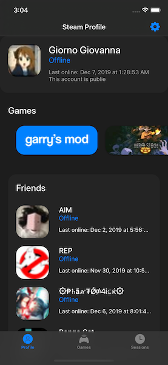
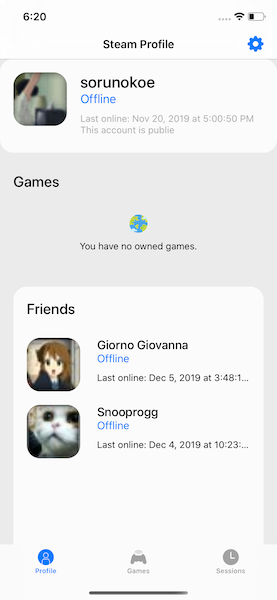
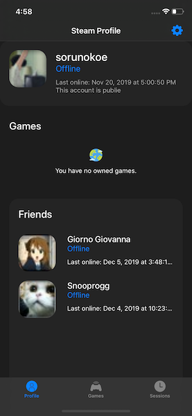
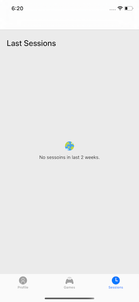

# Ikou
> Challange from [funcodechallenge](https://funcodechallenge.com/]). Steam Interface.

[![Swift Version][swift-image]][swift-url]
[![License][license-image]][license-url]
  

## Features
- [x] Profile: status, private/public, last online
- [x] Friends list
- [x] Owned games
- [x] Dark mode

## Requirements

- iOS 10.0+
- Xcode 10.2.1

## Dependencies
#### Color
- Hue
#### Keyboard
- IQKeyboardManagerSwift
#### Storage
- KeychainSwift
#### Network
- Moya
#### Database
- Realm
#### AutoLayout
- SnapKit

## Screenshots

## Design 
> [FIgma](https://www.figma.com/file/T9PhYjKNKEMU8Or3hBskTx/Ikou?node-id=14%3A2)

## Meta

Yeskendir Salgara– [facebook](https://www.facebook.com/salgara.eskendr) – salgarayes@gmail.com

[https://github.com/sorunokoe](https://github.com/sorunokoe/)

[swift-image]:https://img.shields.io/badge/swift-5.0-blue.svg
[swift-url]: https://swift.org/
[license-image]: https://img.shields.io/badge/License-MIT-blue.svg
[license-url]: LICENSE
[codebeat-image]: https://codebeat.co/badges/c19b47ea-2f9d-45df-8458-b2d952fe9dad
[codebeat-url]: https://codebeat.co/projects/github-com-vsouza-awesomeios-com
